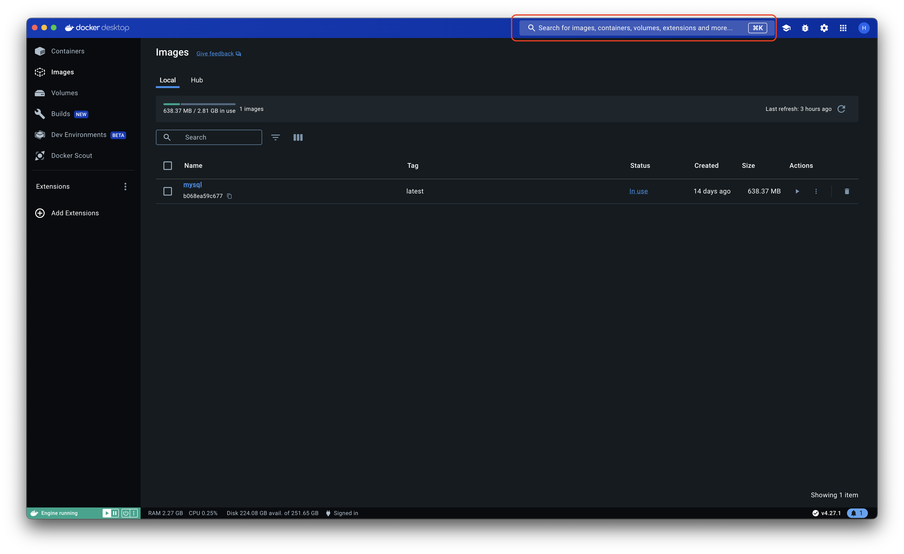
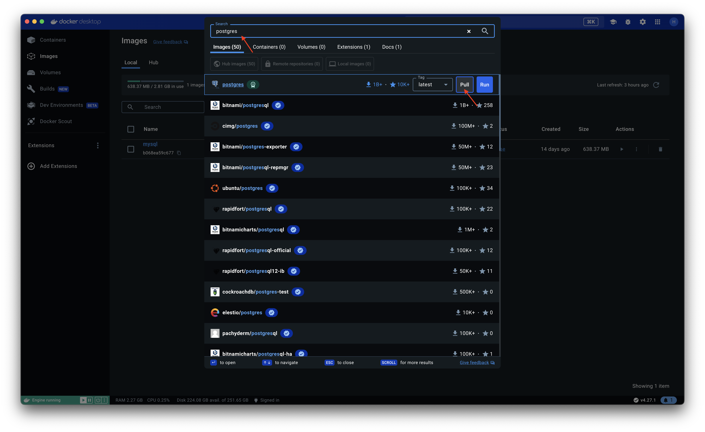
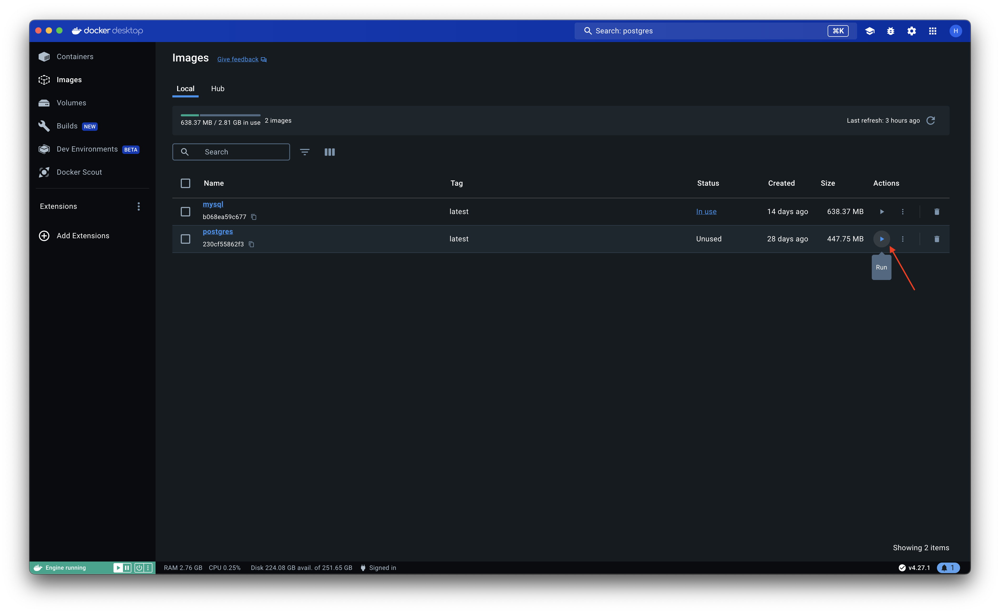
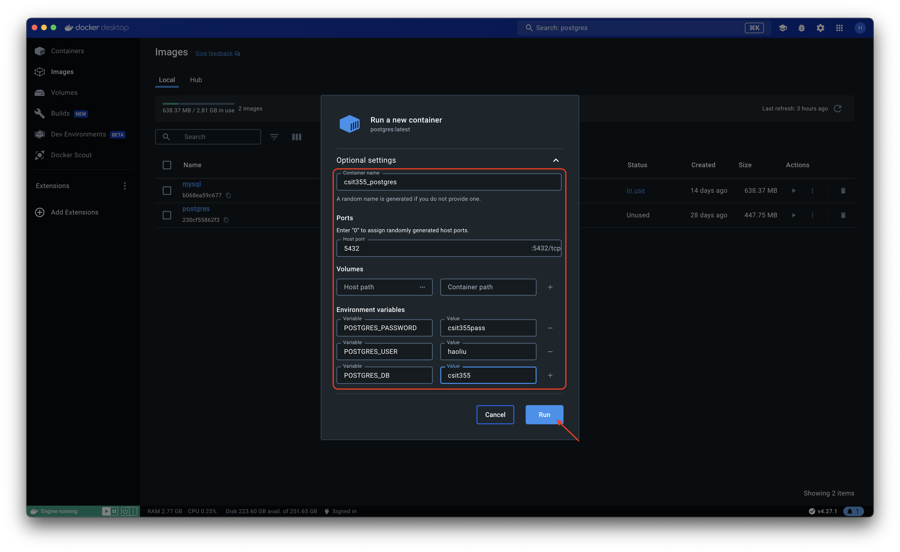
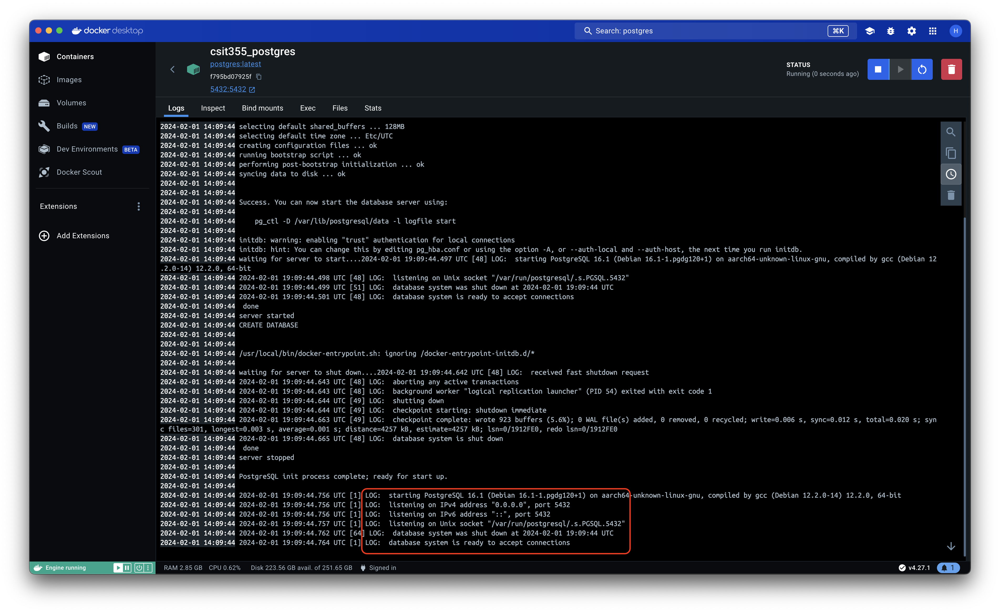
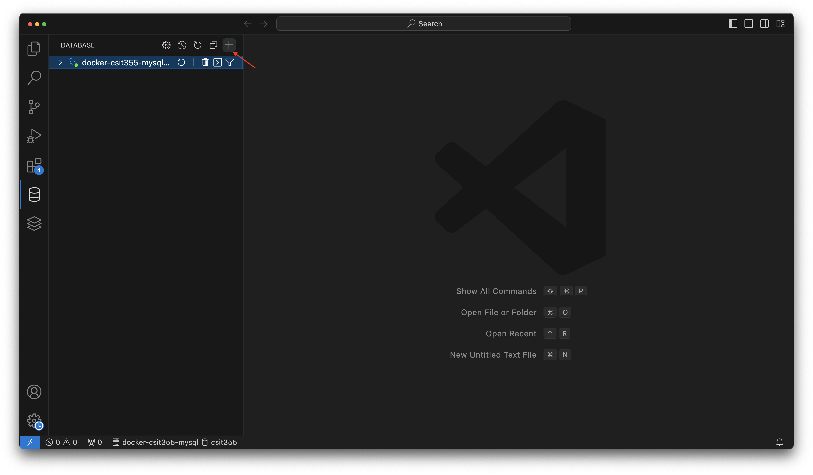
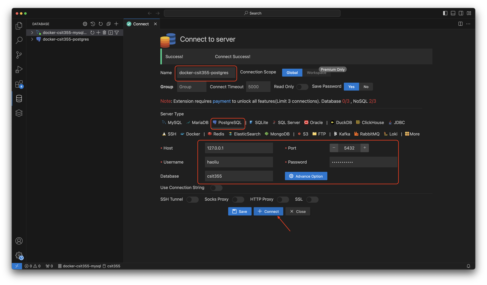
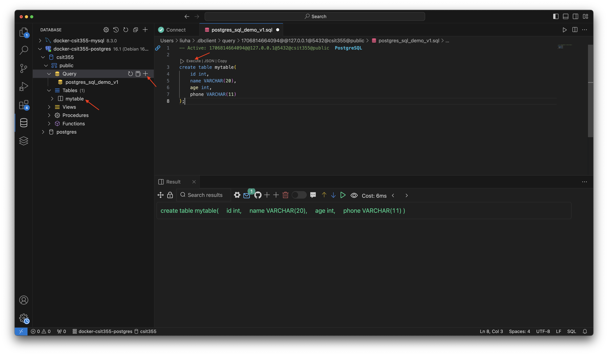

# Tutorial to Create & Connect to Databases with Docker

## Install Docker Desktop
- [Install Docker on Windows](https://docs.docker.com/desktop/install/windows-install/#:~:text=Download%20the%20installer%20using%20the,Program%20Files%5CDocker%5CDocker%20.)
- [Install Docker on Mac](https://docs.docker.com/desktop/install/mac-install/)
  - Docker Desktop for Mac with Apple silicon 
  - Docker Desktop for Mac with Intel chip 

## Setup Mysql with Docker
### Run Docker Desktop

### Search Mysql Image

### Prepare to Run Mysql Image 

### Config Mysql Image to Run

### Check Run Complete

## Connect to Mysql via VSCode
### Install Database Client Extension

### Create a Mysql Connection

### Config the Mysql Connection

### Run SQL queries (e.g., create table)

## Setup Postgres with Docker
### Search Postgres Image

### Pull Postgres Image

### Prepare to run Postgres Image

### Config Postgres Image

### Check Run Complete

## Connect to Postgres via VSCode
### Create a Postgres Connection

### Config the Postgres Connection

### Run SQL queries (e.g., create table)

