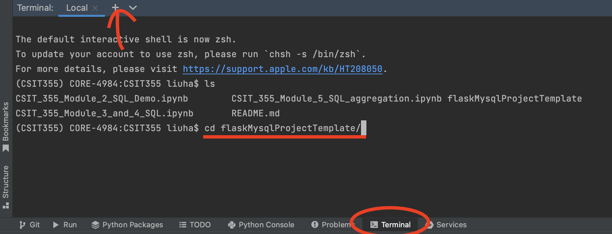
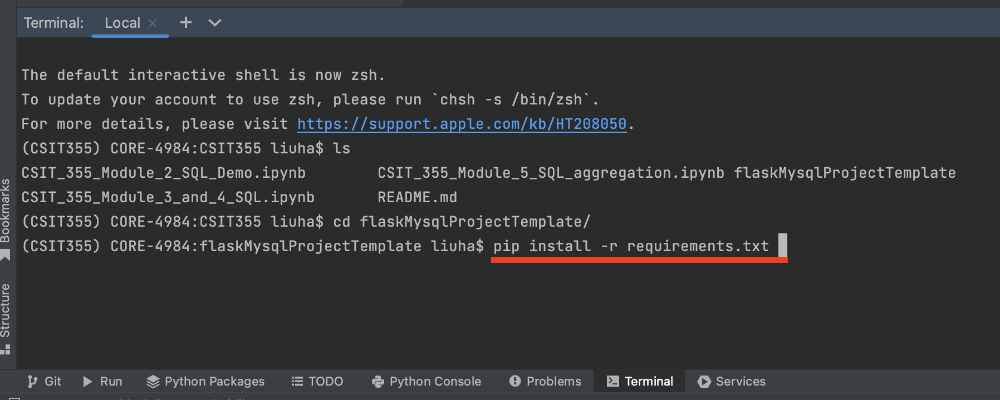
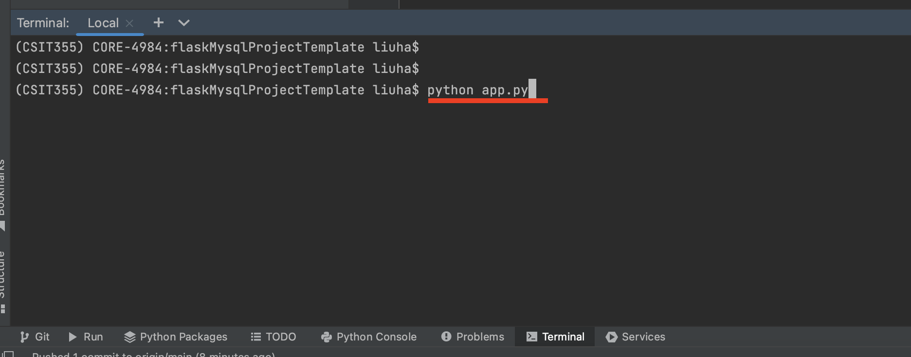

# READ ME

## Step 0: Download the Repository as a .zip File

Open your web browser and go to the GitHub repository URL: https://github.com/profliuhao/CSIT355/tree/main/flaskMysqlProjectTemplate.

Click on the green "Code" button near the top right of the page.

In the dropdown menu, select "Download ZIP."

Save the downloaded .zip file to a directory on your computer.

## Step 1: Extract the .zip File

Navigate to the directory where you saved the .zip file.

Right-click on the .zip file and select "Extract" or "Extract All." Choose a location to extract the files.

## Step 2: Change Directory to the Project

Open your terminal or command prompt.

Navigate into the extracted project directory:

```shell
cd path/to/CSIT355-main/flaskMysqlProjectTemplate
```
(Note: Replace path/to/ with the actual path to the extracted directory.)


## Step 3: Create a Virtual Environment (Optional but Recommended)

It's a good practice to create a virtual environment to isolate dependencies for your project. Run:
```shell
python3 -m venv venv
```

> Activate the virtual environment:
On Windows:
```shell
venv\Scripts\activate
```

> On macOS and Linux:
```shell
source venv/bin/activate
```

## Step 4: Install Dependencies

Use pip to install the required packages:
```shell
pip3 install --upgrade pip
pip3 install -r requirements.txt
```


## Step 5: Configure the Database

Open the MySQLConfig.py file and provide your MySQL database configuration details (username, password, host, database name).

## Step 6: Start the Flask Application

Start the Flask development server:
```shell
python3 app.py
```
or open app.py and click on the run button in Pycharm


## Step 8: Access the Web Application

Open a web browser and navigate to http://localhost:5000.
If website not available, also try http://localhost:9999 (as the port number set in app.py).

## Step 9: Interact with the Application

You can now interact with the Flask application. Explore its features and functionalities.

## Step 10: To stop or quit, press ctrl+c


## For MacOS users
If installing mysql client failed with pk.config errors, 
please try the following 2 steps:
### First, Install Brew
Reference [Home Brew](https://brew.sh/).
Open your terminal and type in the following commands.
``` shell
/bin/bash -c "$(curl -fsSL https://raw.githubusercontent.com/Homebrew/install/HEAD/install.sh)"
```

### Then, export Brew to Path
```shell
echo "export PATH=/opt/homebrew/bin:$PATH" 
```

### Then, Install mysql-client
```shell
brew install mysql-client pkg-config
echo 'export PATH="/opt/homebrew/opt/mysql-client/bin:$PATH"' >> ~/.profile
export LDFLAGS="-L/opt/homebrew/opt/mysql-client/lib"
export CPPFLAGS="-I/opt/homebrew/opt/mysql-client/include"
export PKG_CONFIG_PATH="/opt/homebrew/opt/mysql-client/lib/pkgconfig"
```

### Then, go back to 
```shell
pip install -r requirements.txt
```

----------------------

# Run with Docker
## Step 0
Install Docker (https://docs.docker.com/get-docker/) and start Docker after installation
>MacOS users if installed Homebrew, you can install Docker using
```shell
brew install --cask docker
```
> Then start Docker in your Applications.
## Step 1-2: Same as above

## Step 3: Build docker image

```bash
docker build -t myflaskapp .
```
This will create a Docker image called myflaskapp.

## Step 4: Run the Docker container
```bash
docker run -p 9999:9999 myflaskapp
```
This will start the container and map port 9999 on the host to port 9999 in the container.

Verify that the application is running properly by opening a web browser and navigating to http://localhost:9999.

## Step 5: To stop, press ctrl+c


------------------------------------
# Run with Docker Compose
We can use docker to set up our app and Mysql database using Docker compose with internet connection.
## Step 0
Before you can actually run it you need to build them using
```bash
docker-compose build --no-cache
```
## Step 1
If you are running for the first time you don't need --no-cache. Now, let us run it

```bash
docker-compose up -d
```
That should run the containers successfully, here -d is used to "detach" which basically lets you exit the logs after successfully deploying the containers.

At this point, you should be able to access your API successfully on http://localhost:9999. You can test it out. 

## Step 2
Now to stop the containers you can use
```bash
docker-compose down
```
Read the official docs to see what else you can do with docker-compose. 

## Step 3
To develop and implement more functionality of this application (updating app.py), run 
```bash
docker-compose up -d --build app
```

To access the bash terminal of MySQL containers, run mysql command and create our schema. 

To log in to bash terminal of the MySQL container use:
```bash
docker exec -it mysql-db bash

```
This command basically tells docker to log in to the interactable terminal (-it) of container mysql-db with bash

Now that you are in the container's bash terminal, let's start the MySQL CLI using

```bash
mysql -h localhost -u root -p

```
Here my user is root by default and password we defined in docker-compose. Now, you should be able to access the databases. You can test it using

```sql
SHOW DATABASES;
```
You can add or change a user's access to tables in the database.

```sql
CREATE USER 'haoliu'@'' IDENTIFIED WITH mysql_native_password BY 'csit355_root';


GRANT ALL ON *.* TO 'haoliu'@'' WITH GRANT OPTION;
          
FLUSH PRIVILEGES;
          
-- ALTER USER 'haoliu'@'' IDENTIFIED WITH mysql_native_password BY 'csit355_root2';
```


