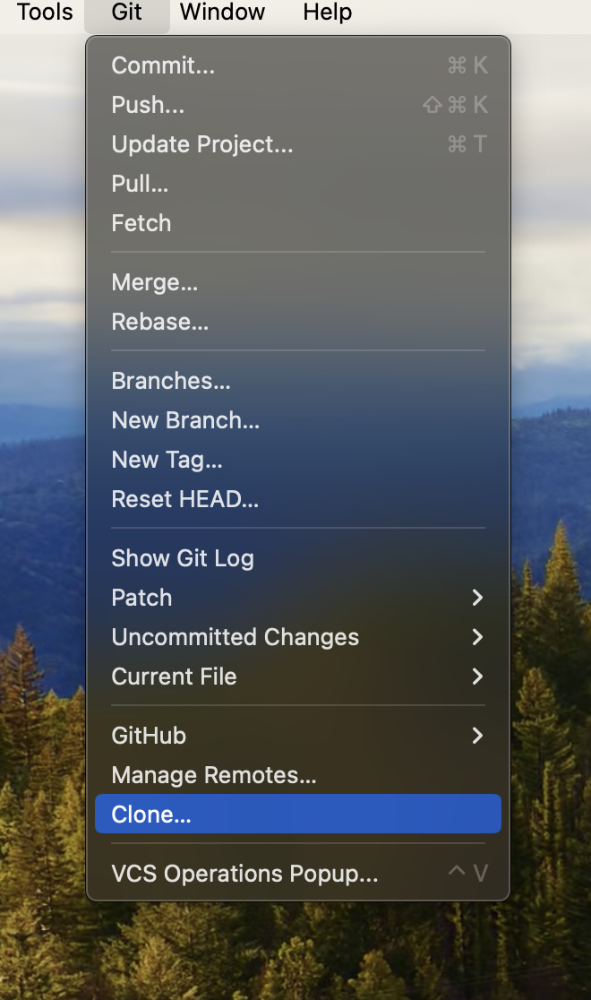
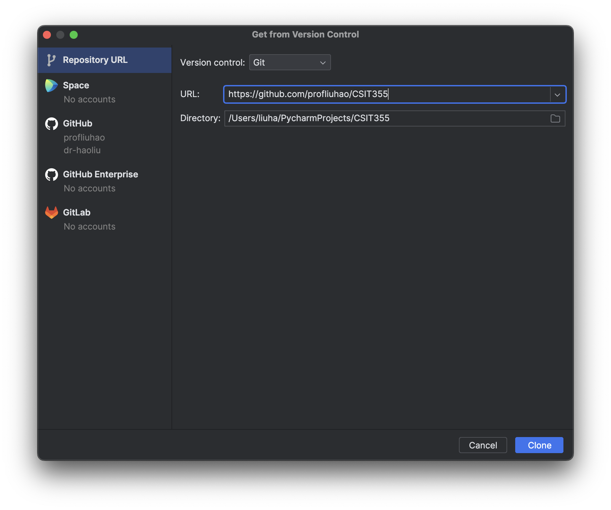

## Step 0: Git clone

Open Pycharm, click on Git

Select Clone...



In the URL, put in https://github.com/profliuhao/CSIT355.



Click on Clone button.


---
## Step 0: Download the Repository as a .zip File

Open your web browser and go to the GitHub repository URL: https://github.com/profliuhao/CSIT355.

Click on the green "Code" button near the top right of the page.

In the dropdown menu, select "Download ZIP."

Save the downloaded .zip file to a directory on your computer.

## Step 1: Extract the .zip File

Navigate to the directory where you saved the .zip file.

Right-click on the .zip file and select "Extract" or "Extract All." Choose a location to extract the files.

## Step 2: Change Directory to the Project

Open your terminal or command prompt.

Navigate into the extracted project directory:

```shell
cd path/to/CSIT355-main/flaskPostgresProjectTemplate
```
(Note: Replace path/to/ with the actual path to the extracted directory.)


## Step 3: Create a Virtual Environment (Optional but Recommended)

It's a good practice to create a virtual environment to isolate dependencies for your project. Run:
```shell
python3 -m venv venv
```

> Activate the virtual environment:
On Windows:
```shell
venv\Scripts\activate
```

> On macOS and Linux:
```shell
source venv/bin/activate
```

## Step 4: Install Dependencies

Use pip to install the required packages:
```shell
pip3 install --upgrade pip
pip3 install -r requirements.txt
```

# Run with Docker Compose
We can use docker to set up our app and Mysql database using Docker compose with internet connection.
## Step 0
Before you can actually run it you need to build them using
```bash
docker-compose build --no-cache
```
## Step 1
If you are running for the first time you don't need --no-cache. Now, let us run it

```bash
docker-compose up -d
```
That should run the containers successfully, here -d is used to "detach" which basically lets you exit the logs after successfully deploying the containers.

At this point, you should be able to access your API successfully on http://localhost:9999. You can test it out. 

## Step 2
Now to stop the containers you can use
```bash
docker-compose down
```
Read the official docs to see what else you can do with docker-compose. 

## Step 3
To develop and implement more functionality of this application (updating app.py), run 
```bash
docker-compose up -d --build app
```
